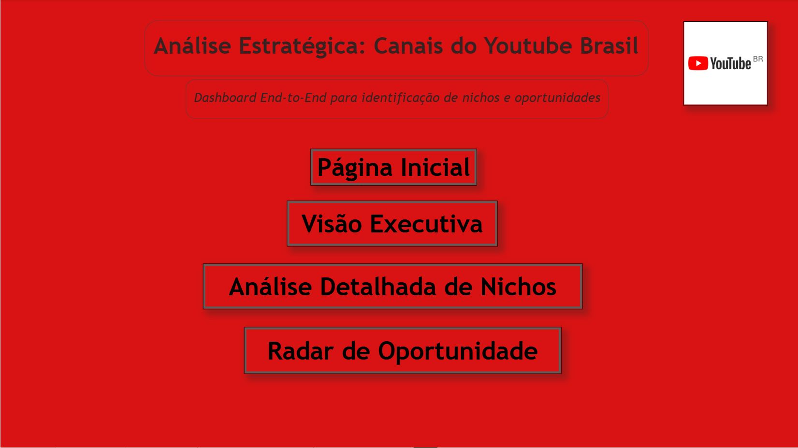
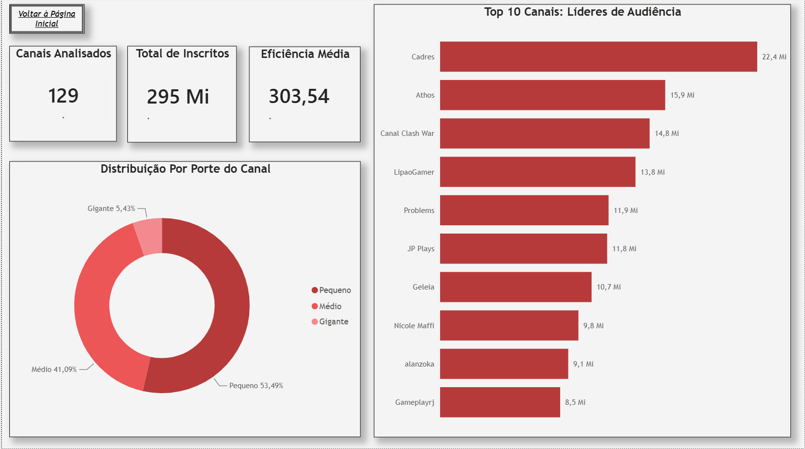
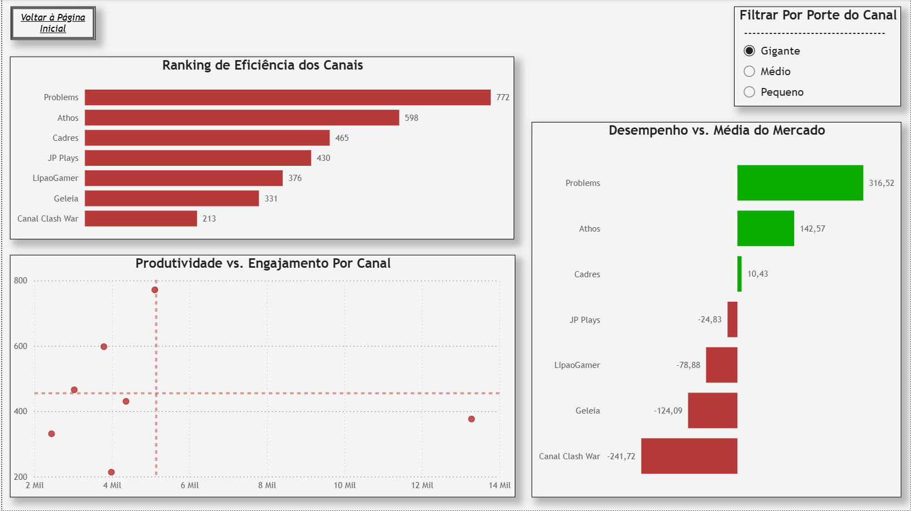
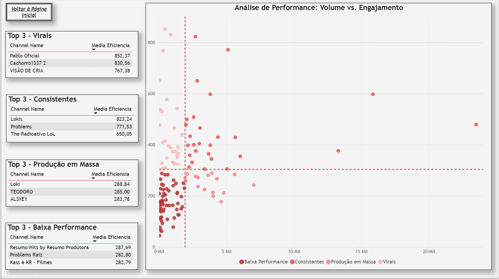

# Análise Estratégica: Canais do YouTube Brasil

Este projeto apresenta uma análise de dados completa (End-to-End) sobre os principais canais do YouTube Brasil, com o objetivo de identificar nichos, tendências de mercado e oportunidades estratégicas.

## 🚀 Sobre o Projeto
O objetivo central foi responder a questões de negócio estratégicas, transformando dados brutos em insights acionáveis através de uma pipeline de dados completa.

## 🛠️ Tecnologias Utilizadas
* **Coleta de Dados:** Dataset obtido via [Kaggle](https://www.kaggle.com/).
* **Limpeza e Tratamento:** Python (Pandas, NumPy) realizado no VS Code, com validação e análise exploratória no Jupyter Notebook para garantir a integridade dos dados e criar métricas de eficiência.
* **Análise e Visualização:** Power BI, utilizando medidas DAX personalizadas para modelagem e criação de um dashboard interativo.

## 📊 Estrutura do Dashboard
O relatório foi desenhado com um sistema de navegação intuitivo, permitindo ao usuário explorar os dados através de quatro visões principais:
1. **Página Inicial:** Capa do projeto.
2. **Visão Executiva:** KPIs principais e panorama geral.
3. **Análise Detalhada de Nichos:** Comparações e desempenho vs. mercado.
4. **Radar de Oportunidade:** Identificação de canais "fora da curva" e análise de performance (Volume vs. Engajamento).

## 🖼️ Visualização do Dashboard

O dashboard foi estruturado com uma navegação intuitiva através de quatro páginas principais:

**1. Página Inicial (Capa)**

**2. Visão Executiva**

**3. Análise Detalhada de Nichos**

**4. Radar de Oportunidade**

## 💡 Principais Insights
O projeto permitiu responder perguntas de negócio fundamentais, como:
* Identificação de perfis comportamentais dos canais brasileiros.
* Classificação de eficiência e porte dos canais.
* Mapeamento de canais "Virais", "Consistentes" e de "Produção em Massa".

